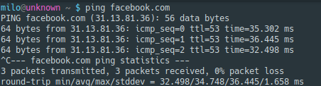
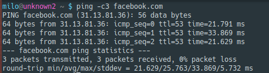

Zadanie 1
-

1. Zaprojektuj oraz przygotuj prototyp rozwiązania z wykorzystaniem oprogramowania ``VirtualBox`` lub podobnego. 
Zaproponuj rozwiązanie spełniające poniższe wymagania:
   * Usługodawca zapewnia domunikację z siecią internet poprzez interfejs ``eth0`` ``PC0``
   * Zapewnij komunikację z siecią internet na poziomie ``LAN1`` oraz ``LAN2``
   * Dokonaj takiego podziału sieci o adresie ``172.22.128.0/17`` aby w ``LAN1`` można było zaadresować ``500`` adresów natomiast w LAN2 ``5000`` adresów    
   * Przygotuj dokumentację powyższej architektury w formie graficznej w programie ``DIA``
   
#### Adresy podsieci
 ``LAN1`` 172.22.128.0/23
 ``LAN2`` 172.22.160.0/19
 
#### PC0:
 
 ``enp0s3`` Połączenie z internetem 
 ``enp0s8`` 172.22.128.1/19 
 ``enp0s9`` 172.22.160.1/23 
 
#### PC1:

 ``enp0s3`` 172.22.128.2/19 
 
#### PC2:
 
 ``enp0s3`` 172.22.160.2/23 
 
#### usage:
 
 1. ``ip addr add`` xxx.xxx.xxx.xxx/xx ``dev`` nazwa interfejsu - set adresy   
>PC0 - 172.22.128.1/19 i 172.22.160.1/23   
>PC1 - 172.22.128.2/19  
>PC2 - 172.22.160.2/23 
 
2. echo 1 > /proc/sys/net/ipv4/ip_forward - set przekazywanie adresów ( ip forwarding )
 
3. ``pico /etc/resolv.conf`` - set default DNS ( 8.8.8.8 )
 
4. ``ip route add default via`` adres_interfejsu_pc0 - set brama domyślna dla hostów
>PC1 - 172.22.128.1/19
>PC2 - 172.22.160.1/23

5. ``iptables -t nat -A POSTROUTING -o ``nazwa_interfejsu ``-j MASQUERADE`` - pozwoli na udostępnienie internetu PC1 i PC2, robimy na PC0
#### network_pc1:
 
 
#### network_pc2:

